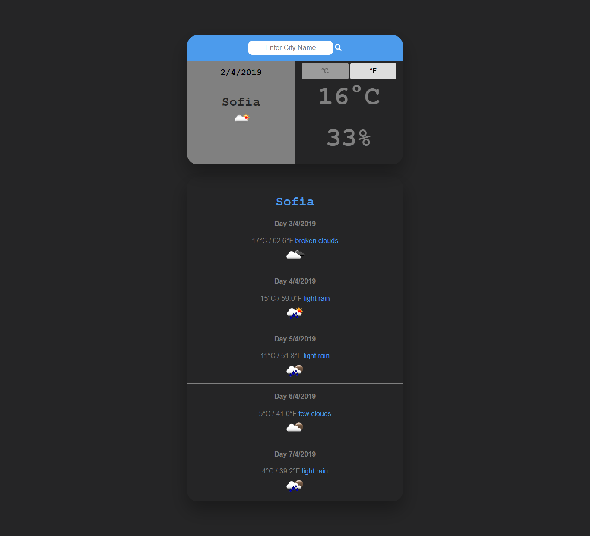

# Weather App

###### Just an application from which you can refer to the current weather forecast as well as 5 days ahead. There is also an option to convert the Celsius degrees to Faranhain

## Live On

https://martinvalchevv.github.io/weather-app/

## Source Code

https://github.com/MartinValchevv/weather-app

## Technologies

JavaScript, jQuery, OpenWeatherMap, CSS and HTML

## Author
Martin Valchev  